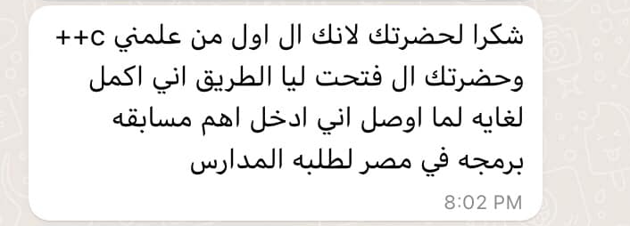

# 🚀 Mastering Basics in C++ for Beginners
*A beginner-friendly guide to learning C++ from scratch. Build a strong foundation with clear explanations, hands-on examples, and practical projects.*

**Under Development**

<!-- 
 -->

## 📸 A Success Story.
**Youssef started learning C++ with me from scratch. Despite being in middle school, he showed incredible enthusiasm, stayed for full sessions, and kept pushing forward. Thanks to his effort and early mentorship, he won the prestigious Al-Quds coding competition, earned a scholarship from the Egyptian Ministry of Communications, and qualified for the National Olympiad in Informatics. I’m truly proud to have been part of his journey. He reminds us that early encouragement can unlock greatness.**

**View all of Youssef’s messages expressing his appreciation:** [Youssef Feedback](./source/Success-Story.md)

## 📅 Table of Contents
- 👉 [Read the Book Online](https://wahba.aiopsvision.com/)
- 📋 [Full Table of Contents](./index.md)
- 📚 [References](#-references)
<!-- - 📖 [Book Overview](#-book-overview)
- 🎯 [Key Features](#-key-features)
- 🎓 [Who Should Read This?](#-who-should-read-this)
- ⏳ [What You Will Save](#-what-you-will-save)
- 🌍 [Real-World Applications](#-real-world-applications)
- 📸 [A Success Story](#-a-success-story)
- 🧹 [Repository Maintenance](#-repository-maintenance)
- 🚀 [Technical Infrastructure](#-technical-infrastructure)
- 📦 [Managing Large Files with Git LFS](#-managing-large-files-with-git-lfs)
- 🔒 [Security Best Practices](#-security-best-practices)
- ✍️ [Contribution Guidelines](#️-contribution-guidelines)
- 📂 [Resources](#-resources)
- 📸 [Highlights from Free Live Book Sessions](#-highlights-from-free-live-book-sessions)
- 👨‍💻 [About the Author](#-about-the-author)
- 📩 [Stay Connected](#-stay-connected) -->

## 📖 Book Overview
This book is the result of intense effort, dedication, and daily work. It teaches C++ fundamentals through step-by-step guidance, real-world examples, and beginner-friendly language. It’s designed for learners with little or no programming experience.

> 📚 Run all code examples in Visual Studio to see output live.

## 🎯 Key Features
- **Zero to Hero:** Start with "Hello World" and progress to clean, efficient code
- **Modern Standards:** Covers best practices
- **Hands-On Learning:** 50+ exercises and projects
- **Free & Open Source:** No paywalls, forever

## 👩🎓 Who Should Read This?
- Absolute beginners in programming
- CS students needing C++ fundamentals
- Developers seeking a structured refresher

**Requirements**
- A computer (Windows/macOS/Linux)
- Basic understanding of math and English

## ⏳ What You Will Save
- **Time:** Skip fragmented tutorials
- **Money:** Free alternative to paid courses
- **Effort:** Gain practical, industry-relevant skills

## 🌍 Real-World Applications
- File I/O and formatting
- Debugging and error handling
- Menu systems and input validation
- Object-oriented design with UML
- Simulation and project-based learning

## 🧹 Repository Maintenance
As the repository grows, we will implement regular cleanup using the Purge Repository Data GitHub Action to regularly clean up unnecessary large files, remove sensitive data, and reduce commit history bloat. These automated cleanups help keep the project secure, lightweight, and contributor-friendly, ensuring long-term efficiency and maintainability.

## 🚀 Technical Infrastructure

### Continuous Integration and GitHub Pages
This repository uses GitHub Actions with automatic Jekyll builds to ensure high code quality and seamless deployment. Every change pushed to the main branch triggers an automated process that builds and deploys the site.

### Branch Protection
We've implemented branch protection policies to maintain code quality:

- Required pull request reviews before merging
- Status checks must pass before merging
- Restricted push access to the main branch

## 📸 Highlights from Free Live Book Sessions.
See all the session photos and feedback here 👉 [Session Highlights](./source/feedback.md)

## 📦 Managing Large Files with Git LFS
- This repository utilizes [Git Large File Storage (LFS)](https://git-lfs.github.com/) to handle large files efficiently. You must be connected to the internet the first time you try to edit or open any LFS-tracked file.

## ✍️ Contribution Guidelines
You're welcome contributions to improve grammar, format chapters, or add code examples. Read our [CONTRIBUTING.md](./source/CONTRIBUTING.md) for details.

**📌 Contribution History Note:**

	Starting from v1.1.0, this project adopted a structured PR-based Fork Workflow.
Earlier commits (before v1.1.0) represent initial content uploads and direct fixes made during the bootstrap phase.
All future contributions follow a professional pull request process with clearly versioned releases.

## 📂 Policies
- [📜 Legal Notice](./source/CODE_OF_CONDUCT.md)

## 🔒 Security Best Practices
Please report any vulnerabilities through the [`SECURITY.md`](./source/SECURITY.md) policy.

## 📚 References
- Aditya Bhargava. *Grokking Algorithms*, Manning.
- Tony Gaddis. *Starting Out with C++*, 8th ed., Addison-Wesley.
- Robert Lafore. *Object-Oriented Programming in C++*, Techmedia.
- Adam Drozdek. *Data Structures and Algorithms in C++*, 4th ed., South-Western.
- D.S. Malik. *Data Structures Using C++*, 2nd ed., Cengage.
- Thomas H. Cormen. *Introduction to Algorithms*, MIT Press.

## 👨‍💻 About the Author
I am a Senior DevOps Engineer with 10+ years of experience in cloud automation, infrastructure as code (IaC), and CI/CD pipeline optimization. My expertise spans:

- ⚙️ Reducing deployment time by 50% through advanced CI/CD automation
- 💰 Optimized cloud costs by 30% through efficient scaling strategies
- ☸️ Building and securing scalable cloud environments using Terraform, Kubernetes, and GitHub Advanced Security across Azure and AWS

## 📩 Stay Connected
Follow the author:
- LinkedIn: [LinkedIn](https://www.linkedin.com/in/wahbamousa/)

---

> **Thank you for being part of this journey. Let’s keep learning and building together!**

© 2025 Wahba Mousa

---
