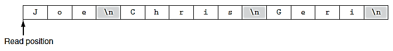
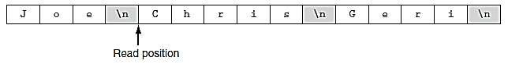
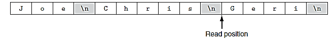
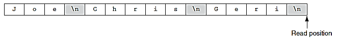

# Chapter 6: files
# Using Files for Data Storage

Most commercial software that you use stores data in files:

-   **Word processors**: Programs that are used to write letters, memos, reports, and other documents.
    
-   **Image editors**: Image editing programs used to draw graphics and edit images.
    
-   **Spreadsheets**: Programs used to work with numerical data.
    
-   **Games**: Many computer games keep data stored in files.
    
-   **Web browsers**: When you visit a web page, cookies typically contain information about the browsing session.

## Output and Input Files

-   **Output file**: A file that data is written to.
    
-   **Input file**: A file that data is read from.
    
-   **Writing data**: Saving data to a file.
    
-   **Reading data**: Retrieving data from a file.

## Types of Files

-   **Text file**: Contains data that has been encoded as text, using a scheme such as ASCII or Unicode. Numbers are stored in the file as characters and can be viewed in a text editor (e.g., Notepad).
    
-   **Binary file**: Contains data that has not been converted to text.

## File Access Methods

-   **Sequential access**: Accesses data from the beginning of the file to the end. Similar to how a cassette tape player works—you can’t jump directly to a specific song.
    
-   **Direct access (random access)**: You can jump directly to any piece of data in the file without reading the data that comes before it. Similar to how an MP3 player works.

## Filenames and File Stream Objects

-   Files on disk are defined by filenames. Extensions like `.jpg`, `.txt`, and `.doc` indicate the type of data stored:
    
    -   `.jpg`: Contains a graphic image compressed using the JPEG image standard.
        
    -   `.txt`: Indicates a text file.
        
    -   `.doc`: Indicates a Microsoft Word document.
        
-   File stream objects work similarly to `cin` and `cout`. When writing data to a file, it is sent to a file stream object. When reading data, it flows from the file stream into variables.

## Setting Up Program for File I/O

Requires the header file:

```cpp
#include <fstream>

```

This provides the declarations necessary for file operations and defines the data types:

File Stream Type

Description

`ofstream`

Output file stream. Used to create a file and write data to it.

`ifstream`

Input file stream. Used to open an existing file and read data from it.

`fstream`

File stream. Used to open files for reading, writing, or both.

## Creating File Object and Opening File

```cpp
ifstream inputFile;
inputFile.open("Customers.txt");

ofstream outputFile;
outputFile.open("Employees.txt");

```

-   The first statement defines an `ifstream` object called `inputFile`.
    
-   The second opens the file and links it to the object.
    

If the specified file already exists, it will be erased when opened with `ofstream`. If not, it will be created.

To specify a full path:

```cpp
inputFile.open("C:\\data\\invent.txt");

```

You can also define and open in one statement:

```cpp
ifstream inputFile("Customers.txt");
ofstream outputFile("Employees.txt");

```

## Closing a File

You should explicitly close files:

-   The OS temporarily stores data in a buffer. Closing the file flushes unsaved data.
    
-   OS limits the number of files that may be open simultaneously.
    

```cpp
inputFile.close();

```

## Writing Data to File

Use `<<` with file streams just like with `cout`:

```cpp
outputFile << "I love programming\n";
outputFile << "Price: " << price << endl;

```

### Example:

```cpp
#include <iostream>
#include <fstream>
using namespace std;

int main() {
    ofstream outputFile;
    outputFile.open("F:\\Programming\\demofile.txt");
    cout << "Now writing data to file.\n";
    outputFile << "Bach\n" << "Beethoven\n" << "Mozart\n" << "Schubert\n";
    outputFile.close();
    cout << "Done.\n";
    return 0;
}

```

## Reading Data from File

```cpp
#include <iostream>
#include <fstream>
#include <string>
using namespace std;

int main() {
    ifstream wahba;
    string name;
    wahba.open("F:\\Programming\\demofile.txt");
    cout << "Reading data from file.\n";
    wahba >> name;
    cout << name << endl;
    wahba >> name;
    cout << name << endl;
    wahba.close();
    return 0;
}

```

## Read Position
When file has been opened for input, file stream object internally maintains special value named read position. file’s read position marks next byte location that will be read from file. when input file is opened, its read position is initially set to first byte in file. so, first read operation extracts data starting at first byte. as data is read from file, read position moves forward, toward end of file. last ex: 


when `>>` operator extracts data from file, it read pieces of data that are separated by whitespace characters (spaces, tabs, or newlines). `>>` operator reads data from file’s current read position, up to \n character. data that is read from file is assigned to name object. `\n` character is also read from file, but isn’t included as part of data. so, name object will hold value "Joe" after executing file’s read position will then be as fig.


after executes, it reads next item from file, which is `"Chris"`, and assigns that value to name object. after this statement executes, file’s read position will be advanced to next item, as Figure.


after executes, it reads next item from file, which is "Geri" and assigns that value to name object. after this statement executes, file’s read position will be advanced to end of file, as fig.


## Reading Numeric Data from Text File

Numbers in a text file are stored as character strings (e.g., "10", "20"). Using `>>` converts them automatically:

```cpp
#include <iostream>
#include <fstream>
using namespace std;

int main() {
    ifstream inFile;
    int value1, value2, value3, sum;
    inFile.open("NumericData.txt");
    inFile >> value1 >> value2 >> value3;
    inFile.close();
    sum = value1 + value2 + value3;
    cout << "Here numbers:\n" << value1 << " " << value2 << " " << value3 << endl;
    cout << "Their sum is: " << sum << endl;
    return 0;
}

```

## Using Loops to Process Files

```cpp
#include <iostream>
#include <fstream>
using namespace std;

int main() {
    ofstream outputFile;
    int numberOfDays;
    double sales;
    cout << "For how many days do you have sales? ";
    cin >> numberOfDays;
    outputFile.open("Sales.txt");
    for (int count = 1; count <= numberOfDays; count++) {
        cout << "Enter sales for day " << count << ": ";
        cin >> sales;
        outputFile << sales << endl;
    }
    outputFile.close();
    cout << "Data written to Sales.txt\n";
    return 0;
}

```

## Detecting End of File

To read all data from a file without knowing how many items:

```cpp
#include <iostream>
#include <fstream>
using namespace std;

int main() {
    ifstream inputFile;
    int number;
    inputFile.open("ListOfNumbers.txt");
    while (inputFile >> number) {
        cout << number << endl;
    }
    inputFile.close();
    return 0;
}

```

## Testing for File Open Errors

### Method 1:

```cpp
ifstream inputFile;
inputFile.open("ListOfNumbers.txt");
if (inputFile) {
    // Process file
} else {
    cout << "Error opening file.\n";
}

```

### Method 2:

```cpp
ifstream inputFile("customers.txt");
if (inputFile.fail()) {
    cout << "Error opening file.\n";
} else {
    // Process file
}

```

## Letting User Specify Filename

```cpp
#include <iostream>
#include <string>
#include <fstream>
using namespace std;

int main() {
    ifstream inputFile;
    string filename;
    int number;
    cout << "Enter filename: ";
    cin >> filename; // or use getline(cin, filename);
    inputFile.open(filename);
    if (inputFile) {
        while (inputFile >> number) {
            cout << number << endl;
        }
        inputFile.close();
    } else {
        cout << "Error opening file.\n";
    }
    return 0;
}

```

## Using `c_str()` in Older C++ Versions

In older versions of C++, a file stream object’s `open()` function won’t accept a `string` object directly as an argument. The `open()` function requires the file name to be passed as a **null-terminated string** (also known as a **C-string**).

-   **String literals** are stored in memory as C-strings by default.
    
-   **String objects** are not, but they have a member function called `.c_str()` that returns the contents as a null-terminated C-string.
    

### Example usage:

```cpp
ifstream inputFile;
string filename = "example.txt";
inputFile.open(filename.c_str());

```

In this case, `filename.c_str()` returns the file name in the correct format required by older C++ compilers.

----------